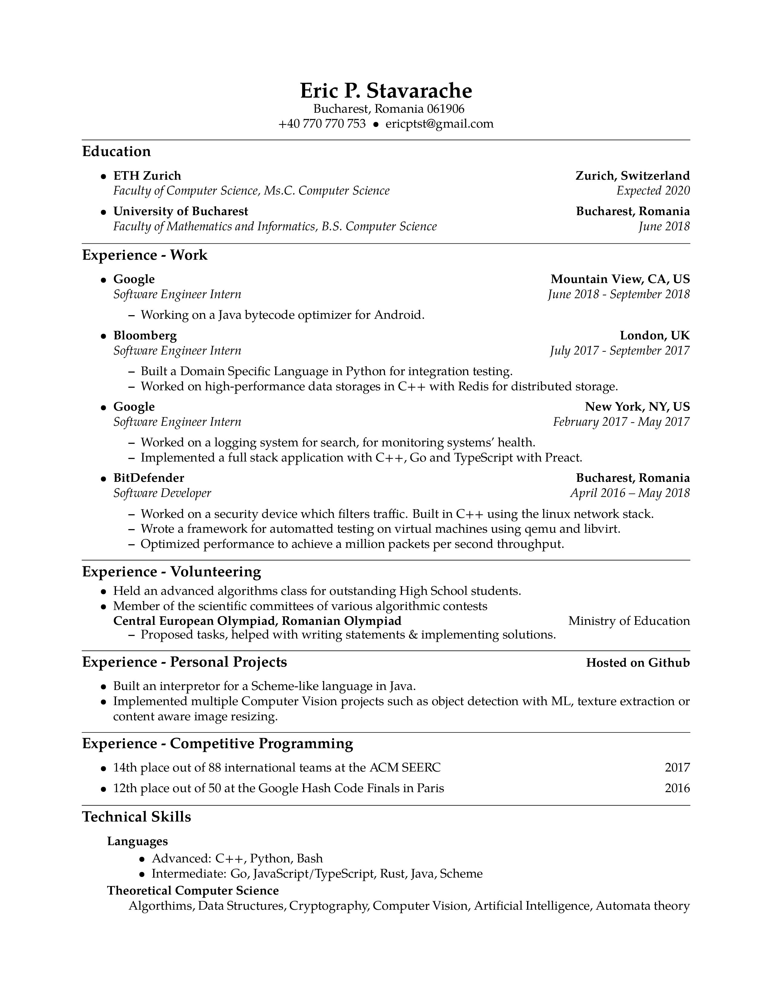

# Resume
My resume.
To be used for inspiration.

# Usage

Normally, a resume should have a single page.
The best strategy that I have found is to have a single master resume,
containing all of your achievements and work, and then filter you the relevant
entries when applying for a certain opportunity.

# Preview

